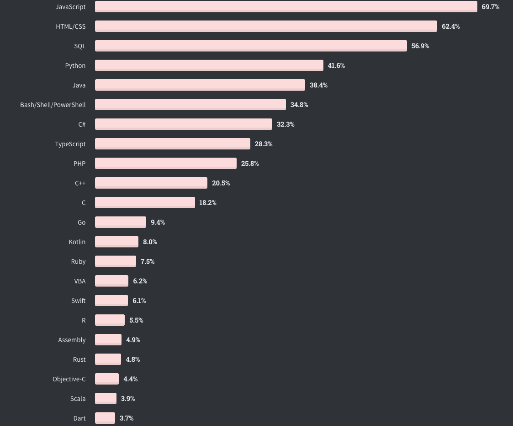

## Types of programming language
Lets see the types of programming language: Actually there are only two types of programming language. **1)Statically typed language.** **2) Dynamically typed language**

There are two types of language **1)Statically typed language.** **2) Dynamically typed language**

**Statically Typed Language:** A language is statically typed if the type of a variable is known at compile time. For some languages this means that you as the programmer must specify what type each variable is (e.g.: Java, C, C++); other languages offer some form of type inference, the capability of the type system to deduce the type of a variable (e.g.: OCaml, Haskell, Scala, Kotlin)
Before learning javascript you should know what is *web*. And how it is architected? 
The main advantage here is that all kinds of checking can be done by the compiler, and therefore a lot of trivial bugs are caught at a very early stage.
Examples: C, C++, Java, Rust, Go, Scala

**Dynamically Typed Language:** A language is dynamically typed if the type is associated with run-time values, and not named variables/fields/etc. This means that you as a programmer can write a little quicker because you do not have to specify types every time (unless using a statically-typed language with type inference).

Examples: Perl, Ruby, Python, PHP, JavaScript

Web is the part of the Internet that can be looked at with a special program (called a browser) and that is made up of many documents which are linked together.

It is divided into two parts: **1) front End.  2) Back end.**

So **what is front end and back end??**

The terms front end and back end refer to the separation of concerns between the presentation layer (front end), and the data access layer (back end) of a piece of software, or the physical infrastructure or hardware. In the client–server model, the client is usually considered the front end and the server is usually considered the back end, even when some presentation work is actually done on the server itself.

So now you understand types of programming language web, front End and backend. Lets now dive into the javascript. 

  ## **what is Javascript???**

*Javascript* is high level, object oriented and dynamically typed programming language.

**High level:** It means we don't have to worry about low level things that is memory management.

**Object oriented:** Based on object for storing most kind of data.

*Javascript* is originally designed to programmatically interact with elements of a webpages.
That is add a click event to a button that shows an alert change the style of an element, manipulate the content of html and css, load data from the servers, building the entire application in the browser which is called the *web application*

Lets have a look to the three core technologies of web that is **HTML CSS and JAVASCRIPT**

## **HTML** 

HTML (HyperText Markup Language) is the most basic building block of the Web. It defines the meaning and structure of web content. Other technologies besides HTML are generally used to describe a web page's appearance/presentation (CSS) or functionality/behavior (JavaScript).

"Hypertext" refers to links that connect web pages to one another, either within a single website or between websites. Links are a fundamental aspect of the Web. By uploading content to the Internet and linking it to pages created by other people, you become an active participant in the World Wide Web.

HTML uses "markup" to annotate text, images, and other content for display in a Web browser. HTML markup includes special "elements" such as head, title, body, header, footer and many others.

An HTML element is set off from other text in a document by "tags", which consist of the element name surrounded by "<" and ">".  The name of an element inside a tag is case insensitive. That is, it can be written in uppercase, lowercase, or a mixture. For example, the title tag can be written as Title, TITLE, or in any other way.

## **CSS**
Cascading Style Sheets (CSS) is a stylesheet language used to describe the presentation of a document written in HTML or XML (including XML dialects such as SVG, MathML or XHTML). CSS describes how elements should be rendered on screen, on paper, in speech, or on other media.

## **JAVASCRIPT** 
JavaScript, on the other hand, is a dynamic programming language that supports Math calculations, allows you to dynamically add HTML contents to the DOM, creates dynamic style declarations, fetches contents from another website, and lots more.

We can also use the analogy of nouns, adjectives and verb. HTML is noun, CSS is adjective and JAVASCRIPT is verbs.

There are lots of programming language in a world then  **WHY WE SHOULD LEARN JAVASCRIPT?**
 Answer is: First you should know that javascript is everywhere. It is in the browser, and browser has become a long way in the last five years into fully fledged application development runtimes. It used to be for viewing just document on the web but now it is in the application as well. Mobile application(react native, ionic), Desktop application(electron), server Side application(nodejs) and we can use javascript for machine learning as well. According to stackoverflow 2020 stastics nearly 70% of professional developers who responded to the stackoverflow survey coded in the javascript.

 

### **Salary of javascript developer:** 
According to indeed.com javascript programmers average salary is $110,673 per year or $47.49 per hr and RS 60,100-RS 1,02,000 per month in Nepal. 

**History and version of javascript:**
  In 1997, due to JavaScript’s rapid growth, it became clear that the language would need to be properly maintained and managed. Therefore, Netscape handed the job of creating a language specification to the European Computer Manufacturers Association (ECMA), a body founded with the goal of standardizing computing. The ECMA specifications were labeled ECMA-262 and ECMAScript languages included JavaScript, JScript, and ActionScript.

Between 1997 and 1999, ECMA-262 had three revisions, but nearly 10 years later, version 4 was abandoned due to differing opinions on the direction of the language and its proposed features. Interestingly, many of these controversial features, such as generators, iterators, and destructuring assignments, have been included in more recent ECMAScript specifications. The year 2005 proved to be a big one for JavaScript. A paper released by Jesse James Garrett introduced Ajax, a revolutionary suite of technologies that included JavaScript. Ajax vastly improved user experience by allowing web pages to feel more like native desktop apps. This really pushed JavaScript into the spotlight as a professional programming language.

This paper is considered to be one of the founding backbones of the JavaScript community. At the time, JavaScript had many challenges, including its verbose nature when doing simple things and the incompatibility issues between browsers. The community responded with large and popular JavaScript frameworks and libraries, such as Dojo and Mootools and jQuery.
Following a 2008 event in Oslo, the ECMAScript 4 proposals were scaled back by many organizations and parties involved with JavaScript, including Yahoo, Google, and Microsoft. The project was codenamed Harmony and it came to fruition in 2015, when ECMAScript 6 was released.

In 2009, the CommonJS project set out to define and promote JavaScript development outside the browser by using modules to package useful code and functionality. This paved the way for Node.js as an environment to run browserless JavaScript. Now the language that ran the frontend of the internet was able to tackle the servers behind the scenes.
From its slightly rocky start, JavaScript has risen to be the most popular programming language in the world. According to GitHub’s 2018 Octoverse report, there are more JavaScript code repositories than any other language—and that number is steadily on the rise.

A series of JavaScript frameworks and libraries, such as Ember, Angular, React, and Vue, have been developed to allow powerful and complicated web applications to be written using small teams within short time spans. Alongside client and server software, it is now even possible to write native mobile apps using JavaScript. Unsurprisingly, this is becoming increasingly popular due to the ability to share code between the worlds of mobile and web.

With all this choice, it’s somewhat understandable that there has also been a movement toward a more grassroots, “vanilla” implementation of JavaScript. Web components, small reusable custom browser elements, are the latest challenger aiming to be the next breakthrough in the JavaScript world. Whatever the next big thing is, it’s clear that JavaScript is going to be with us for many years to come.
## version
>### ...->ES5->ES6(ES2015)->ES7(ES2016)->ES8(ES2017)->ES9(ES2018)->ES10(ES2019)->ES11(ES2020)->...

