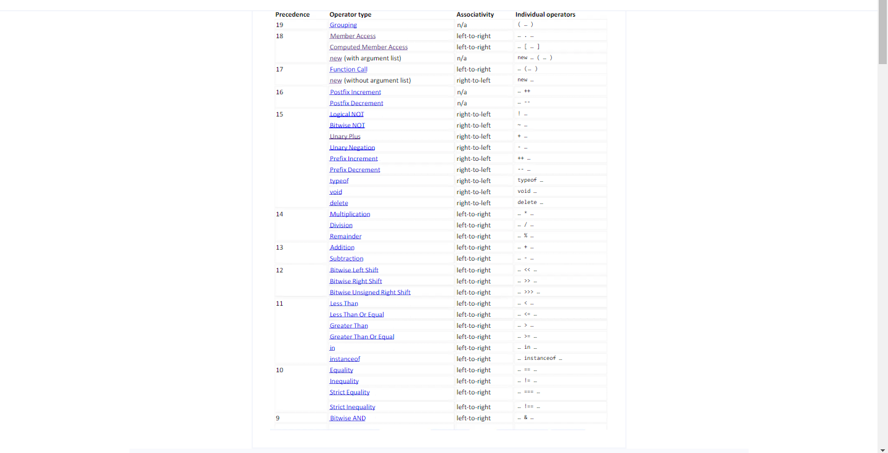

## Assignment operator:
The assignment operator (=) assigns a value to a variable. The +=, -=, /=, *= assignment operator can also be used to add, substract, divide and multiply respectively to the same variables.
```js
const a = 2
const b = "js"
const c = true
let d = 0
console.log(d+=6)//6
console.log(d*=6)//36
console.log(d/=2)//18
console.log(d-=3)//15
console.log(d)//15
```
## Addition operator:
The addition operator (+) adds numbers:
```js
const a = 2
const b = 3
console.log(a+b)//5
```
## Substraction operator:
The subtraction operator (-) subtracts numbers.
```js
const a = 32
const b = 16
console.log(a-b)//16
```
## Multiplication operator:
The multiplication operator (*) multiplies numbers.
```js
const x = 5;
const y = 2;
console.log(x * y);//10
```
## Division operator:

The division operator (/) divides numbers.

```js
const x = 5;
const y = 2;
console.log(x / y);//2.5
```
## Remainder:
The modulus operator (%) returns the division remainder.
```js
const x = 5;
const y = 2;
console.log(x % y);//1
```
## Incrementing:
The increment operator (++) increments numbers by 1.
```js
let x = 5;
console.log(x++)//first stores in the variable and print into the console then increment it
const y = x
console.log(y)//6
console.log(++x)//7. first increment and store into the variable x and print into the console

```
## Decrementing
The decrement operator (--) decrements numbers by 1.
```js
let x = 5;
let y = x--;//first stores in the x variable and assign that value into y and the increment the value of x
console.log(y);//5
let z = x;
console.log(x, z); //4,4
console.log(--x)//3. first decrement the variable x then stores in the value of x and print into the console.
```

## Exponentiation:
The exponentiation operator (**) raises the first operand to the power of the second operand.
```js
const a = 3**5;// means 3 to the power 5
console.log(a)//243
```
## Operator Precedence:
Operator precedence describes the order in which operations are performed in an arithmetic expression.


You dont need to memories this. You will learn thoroughly after practice.

## Comparison operators:
Comparison and Logical operators are used to test for true or false.

### types of comparision operators:
 ==(equals), ===(strict equal), !=(not equal), !==(not strict equal), >(greater than), <(less than), >=(greater than or equal), <=(less than or equal) are the types of comparision operators.

 
 ```js
 const a = 2;
const b = 2;
const c = 3;
const d = "2";
console.log(a == b); // true
console.log(a == d); //true
console.log(a === d); //false. compare both value and the type here type of d is string
console.log(a != d); //false
console.log(a !== d); //true. compare both value and the type here type of d is string
console.log(c > b); //true
console.log(c < b); //false
console.log(c >= a); //true
console.log(c <= a); //false
 ```
## Logical operators:
Logical operators are used to determine the logic between variables or values. &&(and), ||(or), !(not) are the logical operators.

&&:  The AND operator (&&) returns true if both expressions are true, otherwise it returns false.

||: The OR operator (||) returns true if one or both expressions are true, otherwise it returns false.

!: The NOT operator (!) returns true for false statements and false for true statements.
```js
const x = 6;
const y = 3;
//AND
console.log(x < 10 && y > 1); //true
console.log(x < 10 && y < 1); //false
//OR
console.log(x == 5 || y == 5); //false
console.log(x == 6 || y == 0); //true
console.log(x == 0 || y == 3); //true
console.log(x == 6 || y == 3); //true
//NOT
console.log(!(x === y)); //true
console.log(!(x > y)); //false
```
## Conditional (Ternary) Operator:
JavaScript also contains a conditional operator that assigns a value to a variable based on some condition.
variablename = (condition) ? value1:value2

```js
const age = 23
const ages = 12
const voteable = (age < 18) ? "Too young":"Old enough";
const vote = (ages < 18) ? "Too young":"Old enough";
console.log(voteable, vote)// Old enough Too young
```

## we actually dont need bitwise operator in real life if you are so wiling to know about this then contact this lecture's instructor to explain about that.

# **coding challenge 3**:

1. Multiply 20 by 4 and save into the variables. Log it into the console

2. Declare a constant variable and assign it the value of 5 to the power 4 and log it into the console.

3. Declare a constant  and assign it a remainder of dividing 83 by 6 and log it into console.

4. Declare a variable and assign a value 4 using increment operator increase the value by 1 and log it into the console.

5. declare a variable day and assign sunday to that variable. if day is monday log to the console my lucky day otherwise log to the console my worst days

6. declare three variables one, two and three assign 1 to one and 2 to two and three to 4. If three > two and one then log to the console "hurrey" otherwise "bad luck".

https://codesandbox.io/s/hungry-heyrovsky-5v7in?file=/src/index.js


